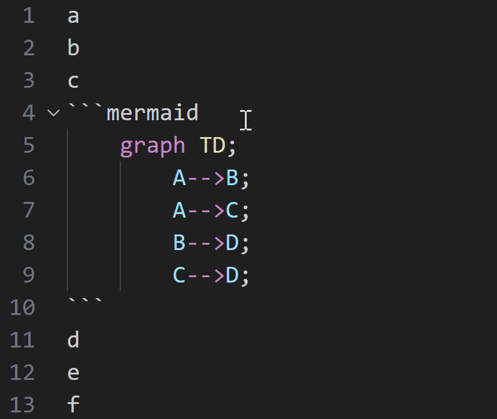

# Mermaid Comment

Comment with `%%` for Mermaid lines and with `<!-- -->` for regular Markdown lines, with a single command.



# Feature

- Comment Mermaid lines with command `mermaid-comment.toggleLineComment`

# Keybindings

## Default

can toggle comment in markdown language with `ctrl+alt+/`.

```json
    {
        "key": "ctrl+alt+/",
        "command": "mermaid-comment.toggleLineComment",
        "when": "editorTextFocus && !editorReadonly && editorLangId =~ /markdown|mermaid/"
    },
```

## Advance

can toggle comment in all languages including Mermaid language with `ctrl+/` like as default

```json
    {
        "key": "ctrl+alt+/",
        "command": "-mermaid-comment.toggleLineComment",
        "when": "editorTextFocus && !editorReadonly && editorLangId =~ /markdown|mermaid/"
    },
    {
        "key": "ctrl+/",
        "command": "mermaid-comment.toggleLineComment",
        "when": "editorTextFocus && !editorReadonly && editorLangId =~ /markdown|mermaid/"
    },
    {
        "key": "ctrl+/",
        "command": "-editor.action.commentLine",
        "when": "editorTextFocus && !editorReadonly"
    },
    {
        "key": "ctrl+/",
        "command": "editor.action.commentLine",
        "when": "editorTextFocus && !editorReadonly && !(editorLangId =~ /markdown|mermaid/)"
    },
```

# Acknowledgments

Inspiration, code snippets, etc.
- [Toggle Line Comments](https://github.com/ArturoDent/toggle-comments)
