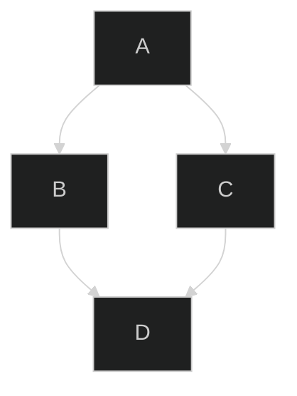

# toggle comment line
toggle comment here
    toggle comment here
        toggle comment here

    toggle comment here
toggle comment here

<!-- toggle comment here -->
toggle comment here
<!-- toggle comment here -->
toggle comment here

# toggle comment mermaid
a
b
c

d
e
f
:::mermaid
graph LR
%% <----- keyword.control.mermaid
%%    ^^ entity.name.function.mermaid
  A --> B;
%%^ variable
%%  ^^^ keyword.control.mermaid
%%      ^ variable
:::
g
h
i
